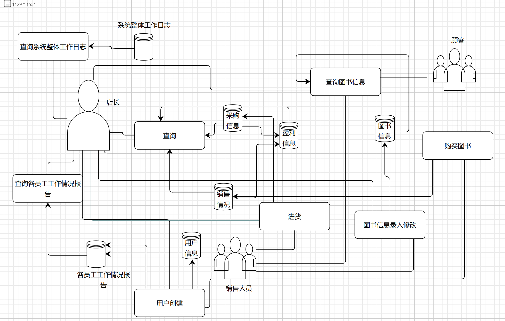
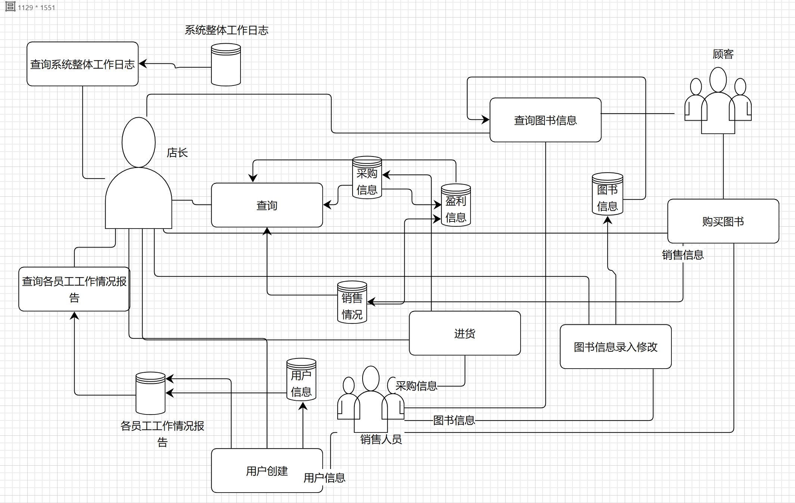

# Bookstore 2024 需求文档

## 目录
* [业务流图](#业务流图)
* [数据流图](#数据流图)
* [数据词典](#数据词典)
* [功能说明](#功能说明)
* [用户交互设计](#用户交互设计)

## 业务流图

## 数据流图

## 数据词典
### 数据流
- 用户信息: 用户类型(字符)、用户名(字符);
- 图书信息: ISBN号(20个字符,每本正版书都有惟一的标识)、书名(60 个字符)、作者(60 个字符)、关键字(可以有多个,总共不超过60个字符)、库存量(整型)、单价(**非负**实数);
- 采购信息: ISBN号(20个字符,每本正版书都有惟一的标识)、数量(整型)、进货价格(**非负**实数);
- 销售信息: ISBN号(20个字符,每本正版书都有惟一的标识)、数量(整型)、单价(**非负**实数);
- 盈利信息: 一段时间(整数区间)、收入(**非负**实数)、支出(**非负**实数)、利润(**非负**实数);
- 各员工工作情况报告: 操作类型(字符)、操作对象(字符);
- 系统整体工作日志: //TODO
### 文件流
- 用户信息: 用户类型(字符)、用户名(字符);
- 图书信息: ISBN号(20个字符,每本正版书都有惟一的标识)、书名(60 个字符)、作者(60 个字符)、关键字(可以有多个,总共不超过60个字符)、库存量(整型)、单价(**非负**实数);
- 采购信息: ISBN号(20个字符,每本正版书都有惟一的标识)、数量(整型)、进货价格(**非负**实数);
- 销售信息: ISBN号(20个字符,每本正版书都有惟一的标识)、数量(整型)、单价(**非负**实数);
- 盈利信息: 一段时间(整数区间)、收入(**非负**实数)、支出(**非负**实数)、利润(**非负**实数);
- 各员工工作情况报告: 操作类型(字符)、操作对象(字符);
- 系统整体工作日志: //TODO
## 功能说明
### 查询图书信息
- 功能: 按ISBN号、书名、作者、关键字的任意组合查询图书相关信息
- 操作方式: 输入ISBN号、书名、作者、关键字的任意组合
### 购买图书
- 功能: 通过给定图书的ISBN号、购买数量进行购买
- 操作方式: 输入所买图书的ISBN号以及购买的数量
### 查询采购信息
- 功能: 按ISBN号查询该图书的采购情况(包括数量和进货价格)
- 操作方式: 输入所查询图书的ISBN号
### 查询销售信息
- 功能: 按ISBN号查询该图书的销售情况(包括数量和单价)
- 操作方式: 输入所查询图书的ISBN号
### 查询盈利信息
- 功能: 输入查询的时间区间
- 操作方式: 输出该段时间内书店的收入、支出、利润
### 进货
- 功能: 采购一定数量的某种图书
- 操作方式: 输入该图书的ISBN号、采购数量和进购价格
### 用户创建
- 功能: 创建一个新的账户
- 操作方式: 输入用户类型和用户名
### 查询各员工工作报告
- 功能: 查询各员工的各个操作类型及操作对象的信息
- 操作方式: 输入员工的用户名
## 用户交互设计
### 顾客管理模块
- 用户注册 `register username`\
输出结果 `succeed/fail`
- 用户登录 `login user name`\
输出结果 `succeed/fail`
### 员工管理模块
- 用户注册 `register username`\
  输出结果 `succeed/fail`
- 用户登录 `login user name`\
  输出结果 `succeed/fail`
- 查询员工信息 `find username`\
  输出结果 `succeed/fail`
- 修改员工信息 `modify username`\
  输出结果 `succeed/fail`
- 员工离职 `delete username`\
  输出结果 `succeed/fail`
### 查询信息
- 查询内容 `input inquiry things`\
  输出结果 `succeed/fail`
### 查询采购信息
- 采购内容 `input purchase`\
  输出结果 `succeed/fail`
### 查询销售信息
- 销售内容 `input sells`\
  输出结果 `succeed/fail`
### 查询盈利信息
- 时间区间设定 `input time period`\
  输出结果 `succeed/fail`
### 查询各员工工作报告
- 查询员工 `input username`\
  输出结果 `succeed/fail`
